Nesta seção será apresentado como são gerenciados os anos letivos escolares das escolas e as matrículas dos alunos no ano letivo. Serão vistos também como são configurados o Calendário letivo e o Quadro de horários, bem como qual o procedimento para efetuar a reserva de vaga, a rematrícula automática e o gerenciamento dos históricos escolares.

## Módulos

Neste cadastro você poderá informar quais os módulos existentes na instituição de ensino. Estes módulos definem o período de semanas e meses das etapas de uma série/ano.

> **Localização:** Módulo Escola > Cadastros > Tipos > Escolas > Tipos de Módulos

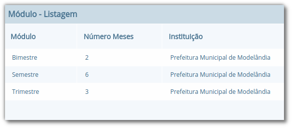

Na Figura 39, pode ser visualizada a listagem dos três módulos mais comuns: Bimestral, Semestral, Trimestral.

## Ano letivo escolar

Neste cadastro é possível gerenciar os anos letivos das escolas. Ao abrir o cadastro de uma escola, na parte inferior serão exibidos todos os anos finalizados, em andamento e ainda não iniciados. Caso o ano escolar que se deseja gerenciar não conste na listagem, pode ser utilizado o botão **Definir ano letivo** para cadastrar um novo ano.

> **Localização:** Módulo Escola > Cadastros > Escola > Selecionar escolar

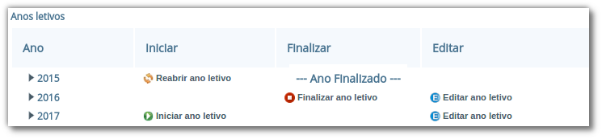

Ao pressionar o botão **Editar ano letivo** da Figura 40, uma nova página será apresentada conforme ilustrado na Figura 41.

No exemplo da Figura 41, foram informados dois módulos semestrais e suas datas de início e fim. Para adicionar as etapas, basta selecionar o módulo desejado na opção **Módulo**, informar os períodos nas opções **Data inicial** e **Data final**, e a quantidade de Dias Letivos se o usuário desejar, e pressionar o botão **+ Adicionar novo** para inserir as outras etapas. Para concluir a operação, o usuário deve pressionar o botão **Salvar**.

> **Nota:** A quantidade de módulos informada em um ano letivo escolar é igual à quantidade de notas que um aluno precisa obter nesse ano letivo. Desta forma, no exemplo da Figura 41, o aluno precisaria obter 2 (duas) notas no ano letivo em questão.

## Bloqueios

Neste tópico serão apresentadas as duas formas de bloqueio existentes no sistema, sendo possível efetuar o bloqueio de um ano letivo completo, ou somente de etapas específicas para escolas especificas, no caso de bloqueio de lançamento em faltas e notas.

### Bloqueio do ano letivo

Esta funcionalidade possibilitará o controle na inserção de faltas e notas dos alunos, impedindo que dados sejam alterados ou inseridos erroneamente. Para habilitar esse bloqueio em seu município, basta você selecionar o botão **Novo** abaixo da listagem e preencher os campos obrigatórios, como podemos ver na Figura 42.

> **Localização:** Módulo Escola > Ferramentas > Parâmetros > Bloqueio do ano letivo

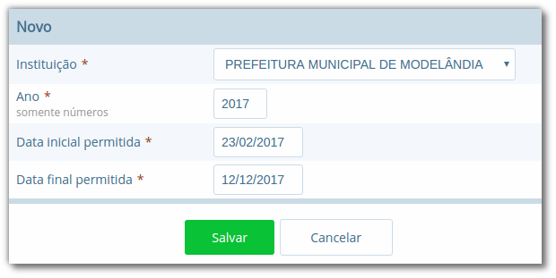

Após salvar o cadastro, as faltas e notas dos alunos poderão ser inseridas e alteradas somente entre os dias da **Data inicial** e **Data Final** estabelecidas no bloqueio, e caso o usuário tente lançar fora do período, o sistema apresentará a seguinte mensagem no lançamento de notas: “*O lançamento de notas nessa instituição está bloqueado nesta data.*”

### Bloqueio de lançamento de notas e faltas

Diferentemente do **Bloqueio do ano letivo**, citado acima, o **Bloqueio de lançamentos de notas e faltas**, possibilita ao usuário que implemente uma restrição no sistema para uma determinada etapa (ou todas) assim como para cada escola de forma individual.

> **Localização:** Módulo Escola > Ferramentas > Parâmetros > Bloqueio de lançamentos de notas e faltas

Para habilitar este bloqueio em seu município ou somente na sua escola, basta você selecionar o botão *Novo* na listagem e preencher os campos obrigatórios, como podemos ver na figura abaixo:

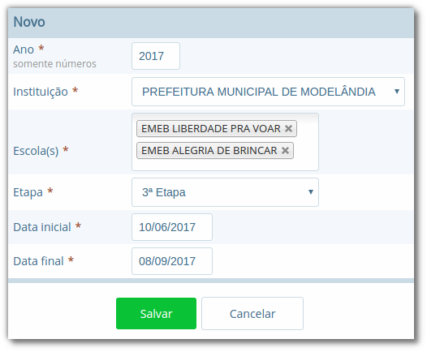

Após salvar o cadastro, as faltas e notas dos alunos poderão ser inseridas e alteradas somente entre os dias da **Data inicial** e **Data Final** estabelecidas na etapa e escolas inseridas no bloqueio, e caso o usuário tente lançar fora do período, o sistema apresentará a seguinte mensagem no lançamento de notas: “*O lançamento de notas nessa instituição está bloqueado nesta data.*”

> **Nota:** O Bloqueio do ano letivo e o Bloqueio de lançamento de notas e faltas são semelhantes, a única diferença é que a segunda opção permite selecionar escolas específicas para efetuar o bloqueio de uma etapa em um período de datas, enquanto que a primeira bloqueia para todas as escolas da instituição.

## Calendário letivo

No cadastro de **Calendários** é possível registrar informações por escola referente ao ano letivo, tais como datas comemorativas e dias extras que contam ou não como dia letivo, ou qualquer outra informação pertinente ao calendário escolar.

> **Localização:** Módulo Escola > Cadastros > Calendários

Ao acessar o menu do cadastro, pode-se visualizar ou buscar por um calendário existente ou cadastrar um novo por meio do botão **Novo calendário letivo**, caso não exista nenhum.

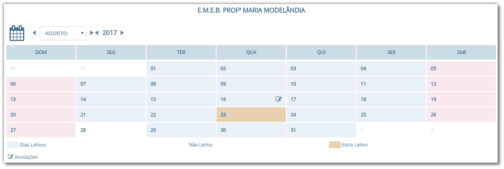

Quando um calendário é aberto, na parte superior do calendário é possível navegar entre os meses e anos letivos da escola. As datas no calendário são exibidas em cores diferenciadas. A cor rosa representa os dias que não contam como letivos (sábados, domingos, etc.), a azul os dias letivos e a laranja os dias extra letivos. Quando um dia for definido como não letivo no calendário, exibe a cor branca.

No cadastro de **Tipos de evento do calendário** é possível informar as datas as quais são consideradas como dias extra letivos (opção **Tipo** marcada como **Extra**) ou as que não contam como dia letivo (opção **Tipo** marcada como **Não-letivo**).

> **Localização:** Módulo Escola > Cadastros > Tipos > Calendários > Tipos de evento do calendário

Estes eventos podem ser usados para identificar datas especiais onde não seria um dia letivo, mas devido a algum trabalho extraclasse considerou-se aquele dia como letivo, ou ainda, casos em que se considerava o dia como letivo, mas por alguma razão especial se anulou a contagem como dia letivo.

Depois de inseridos os eventos, basta o usuário clicar em uma data no calendário e inserir por meio do botão **Dia Extra/Não Letivo** a informação desejada. O registro pode ser aplicado apenas a algumas determinadas turmas, como pode ser visto na Figura 45.

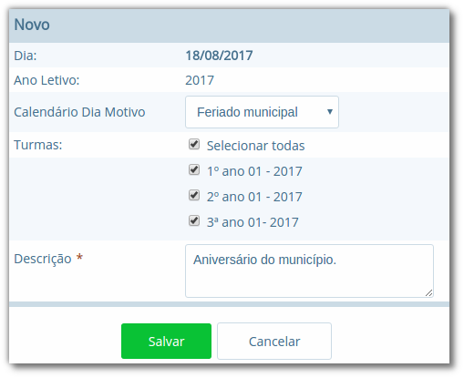

Caso o usuário pressione o botão **Nova anotação**, será aberto um cadastro para anotação de informações daquela data. Quando uma anotação é inserida, no calendário é exibida a letra **A**, informando que para aquela data existe uma nota. Para visualizar a nota, basta passar o mouse sobre a data no calendário.

## Processo de Matrícula

O processo de Matrícula está localizado no cadastro do aluno, onde logo na página de detalhe do cadastro é exibido um histórico das matrículas do aluno. Nesta página, existem várias opções dentre elas a de nova matrícula, acesso ao histórico e opção <u>Visualizar</u> em cada matrícula que permite tratar os processos individualmente.

> **Localização:** Módulo Escola > Cadastros > Aluno > Selecionar Aluno > Seção Matrículas

O histórico das matrículas do aluno é apresentado na Figura 48, onde como se pode ver, é possível visualizar o ano letivo, situação da matrícula, turma, série, curso, escola e também data de entrada e data de saída desta matrícula.

Para efetuar uma nova matrícula, pressione o botão **Nova Matrícula** e preencha os dados do *Curso*, *Série*, *Turma*, *Ano de Destino* e *Data da Matrícula* como mostra a Figura 49.

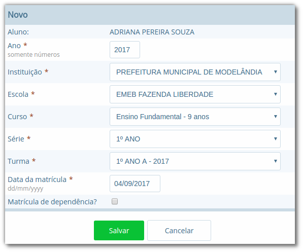

A enturmação de um aluno pode ser feita diretamente no ato da matrícula, informando a turma desejada no campo Turma.

Para gerenciar o processo de cada matrícula, selecione a opção <u>Visualizar</u> na lista de matrículas do aluno e então algumas opções serão exibidas, como mostra a Figura 50 a seguir:

Opção | Como funciona?
---|---
Cancelar Matrícula | Ao selecionar esta opção, o usuário será questionado se deseja realmente prosseguir. Efetuando este procedimento, a matrícula atual será cancelada e não mais exibida na página principal do aluno, prevalecendo a situação da matrícula anterior.
Ocorrências Disciplinares | Esta opção permite ao usuário informar registros de comportamento do aluno, informando um tipo de ocorrência disciplinar com uma data, hora e descrição. As ocorrências poderão ser inseridas também por meio do menu Lançamentos > Ocorrências disciplinares.
Dispensa de componentes curriculares | Esta opção permite dispensar o aluno de uma determinada disciplina no ano letivo ou em uma etapa específica, em função de algum motivo que o impeça de frequentá-la.
Enturmar | Ao selecionar esta opção, serão listadas todas as turmas para a série/ano a qual o aluno está matriculado, informando também a data efetiva da matrícula, podendo então selecionar uma da lista e processar a nova enturmação ou troca de turma.
Turno | Esta opção permite definir um turno específico para a matrícula do aluno (geralmente utilizado pela Educação infantil), sendo diferente da turma vinculada.
Abandono | Ao utilizar esta opção, uma caixa de diálogo será exibida, solicitando ao usuário a confirmação de abandono de matrícula. A partir deste momento, qualquer escola da rede de ensino poderá processar uma nova matrícula para o aluno.
Reclassificar | Esta opção permite ao usuário reclassificar o aluno para uma série seguinte ou anterior se for o caso. Após efetuar este processo, a situação da matrícula na série atual ficará como Reclassificado e da matrícula da série a qual ele foi reclassificado como Cursando, ficando pendente a enturmação na turma da nova série.
Solicitar Transferência | Esta opção permite ao usuário processar o pedido de transferência do aluno. Ao acessar a opção, o usuário definirá se a transferência é para uma escola da rede, ou outra, e o Motivo da transferência. Depois de confirmada a transferência, qualquer escola da rede de ensino poderá processar uma nova matrícula para o aluno.
Formando | Esta opção permite ao usuário marcar a matrícula do aluno como Formando. Este processo pode ser útil para consultas e emissão de relatórios dos formandos de determinado ano letivo.
Histórico de enturmações | Esta opção permite que o usuário consulte todas as movimentações realizadas naquela matrícula, apresentando a data e o usuário que efetuaram a última movimentação.

> **Nota:** No momento que o aluno em transferência for admitido na escola Destino, as notas da escola Origem serão copiadas para esta nova matrícula na escola Destino, nos casos em que a regra de avaliação for igual.

Para um maior controle e posteriormente identificação dos motivos de abandono, é possível registrar no campo ‘Observações’ esta informação como mostra a Figura 51.

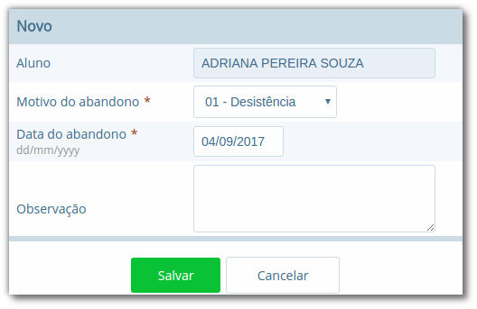

> **Nota:** O processo de *Abandono*, assim como o de *Transferência*, poderá ser revertido, voltando na matrícula do aluno e selecionando '*Desfazer Abandono*'.

## Processo de Enturmação

O processo de Matrícula relaciona um aluno com um curso, série em um determinado ano letivo, porém, para que o aluno esteja apto a receber faltas e notas e seja exibido em relatórios, é necessário realizar o processo de **Enturmação**.

> **Localização:** Módulo Escola > Movimentações > Enturmações em lote

O procedimento pode ser realizado tanto pelo menu de Movimentações > Enturmações em lote quanto diretamente no momento de efetuar a Matrícula. 
Se o fizer pelo processo de Enturmação, ao acessar este cadastro serão exibidas todas as turmas cadastradas para série/ano e ao acessar o registro de uma turma na listagem, serão exibidos todos os alunos já enturmados nesta turma, e também os matriculados e não enturmados, que pertencem à mesma série/ano correspondente, e serão apresentados com uma opção para o usuário marcar ou não, conforme pode ser visualizado na Figura 52, para enturmar nesta turma, e ao clicar no botão **Salvar** estes alunos serão enturmados.

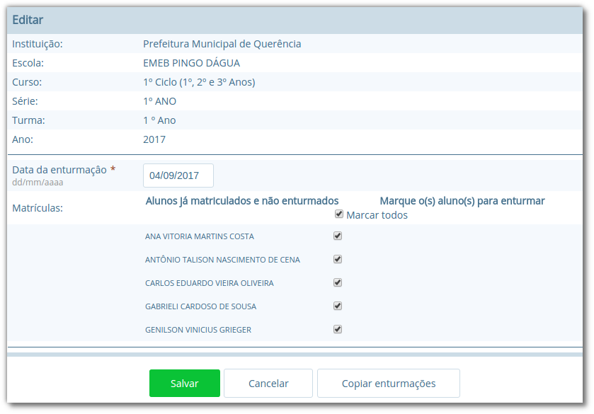

Caso ao acessar uma turma na listagem e todos os alunos daquela série/ano já estiverem enturmados, será exibida uma mensagem informando o usuário desta situação.

No processo de Enturmação em lote, é possível ainda, por meio do botão **Copiar enturmações** efetuar a cópia das enturmações da turma que está sendo configurada, para outra turma, inclusive de série e curso diferentes, criando uma nova matrícula em lote para os alunos selecionados.

É possível realizar múltiplas enturmações para um aluno quando existem várias turmas pertencentes a um mesmo série/ano, porém este procedimento somente poderá ser realizado por meio das operações de matrícula, acessada por meio do link <u>Visualizar</u> em Matrículas do cadastro de Alunos.

A operação de Enturmação também poderá ser desfeita dentro da Matrícula do cadastro do Aluno, assim como a troca de turma internamente. Ao clicar em **Enturmar** na matrícula e selecionar a turma, existem quatro opções, ‘Remover (enturmação) da turma selecionada' ou 'Enturmar na turma selecionada', ou 'Transferir para a turma selecionada', e ainda a opção de 'Voltar' se não desejar realizar nenhuma dessas opções.

> **Localização:** Módulo Escola > Cadastros > Alunos > Selecionar Aluno > Visualizar Matrícula > Botão Enturmar

> **Nota:** É importante salientar que as opções ‘**Remover (enturmação) da turma selecionada**' ou '**Enturmar na turma selecionada**' não são apresentadas na mesma página, sendo que a primeira é listada quando selecionada uma turma que o aluno já possuí vínculo, e a segunda em uma turma que o aluno ainda NÃO possui vínculo.

## Sequência de enturmação e Rematrícula automática

O processo de **Sequência de enturmação** está localizado no menu Cadastros > Tipos do módulo Escola, e é necessário ser configurado para que o processo de rematrícula automática possa ser executado.

> **Localização:** Módulo Escola > Cadastros > Tipos > Séries > Sequência de enturmação

As sequências de enturmações definem o curso e a série/ano de origem e o curso e a série/ano de destino, conforme pode ser visualizado na Figura 54.

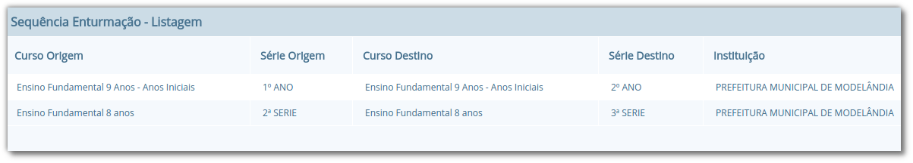

O processo de **Rematrícula automática** está localizado no menu Movimentações e neste cadastro, basta o usuário selecionar a Escola, Curso, Série, Turma do ano anterior, Ano de Destino e Data da Matrícula. E por fim pressionar o botão **Salvar**.

> **Localização:** Módulo Escola > Movimentações > Rematrícula automática

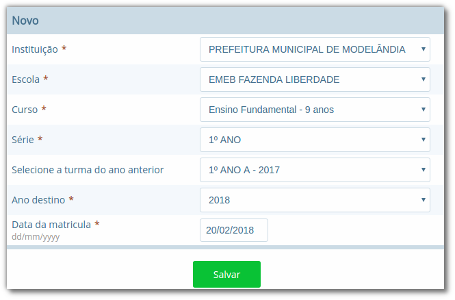

Este procedimento rematriculará todos os alunos de uma determinada turma automaticamente no próximo ano letivo corrente da escola, como mostra a Figura 56.

## Histórico escolar

O processamento do Histórico escolar permite que sejam gerados os históricos escolares dos alunos com base nas informações de notas e faltas lançadas durante o ano letivo.

> **Localização:** Módulo Escola > Processos > Histórico escolar

O processo consiste em 3 fases: filtragem dos dados, parametrização, e processamento dos históricos. Na Figura 57 é apresentado o formulário para filtragem dos dados a serem gerados.

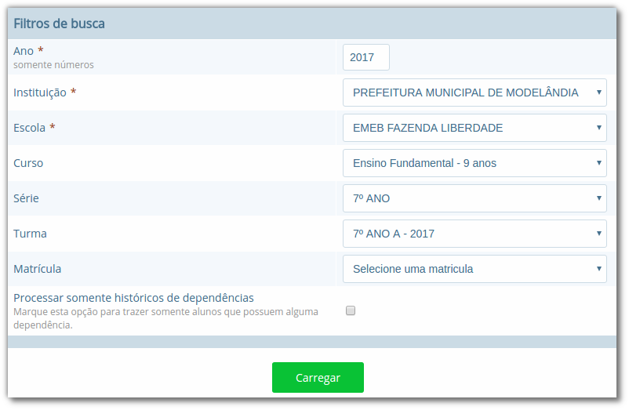

Conforme apresentado na Figura 57, o usuário tem a liberdade de executar o processamento de todos os alunos de uma escola, pois os campos obrigatórios são apenas **Ano**, **Instituição** e **Escola**, mas sugere-se que se efetue por **Turma**, em função da quantidade de informações a serem processadas.

O processamento é flexível e permite ao usuário definir se a geração utiliza informações do sistema, registradas durante o ano letivo, ou se considera alguns parâmetros definidos manualmente no momento da geração. As opções referentes a esta configuração serão explicadas a seguir, sendo as opções marcadas com o asterisco (*) obrigatórias:

Opção | Como funciona?
---|---
Quantidade de dias letivos* | Refere-se à quantidade de dias letivos do Calendário Escolar.
Grade curso* | Refere-se à grade curricular do curso que foi selecionado, se for do curso de 9 anos, informar a opção **Ano**, e se for de 8 anos, informar **Série**.
% Frequência* | Refere-se ao percentual de frequência obtido pelo aluno no ano letivo. Se selecionada a opção **Usar do boletim**, o sistema gerará no Histórico Escolar o que foi lançado para o aluno, e caso selecionada a opção **Informar manualmente** um novo campo será aberto para informar manualmente.
Situação* | Refere-se à situação da matrícula do aluno no ano letivo em questão. Se selecionada a opção **Usar do boletim**, o sistema gerará no Histórico Escolar a situação que está no boletim atualmente. Se desejar informar manualmente, basta escolher entre as opções: **Em andamento**, **Aprovado**, **Reprovado** ou **Transferido**.
Disciplinas* | Refere-se às disciplinas que o aluno cursou no ano letivo em questão. Basta selecionar a opção **Usar do boletim** para que o histórico escolar seja processado com as disciplinas que o aluno cursou. Caso selecione a opção **Informar manualmente**, um novo campo será aberto para informar manualmente a disciplina e a nota. A opção **AP** é normalmente utilizada para o 1º, 2º e 4º Ano, onde no documento Histórico Escolar deve ser registrado apenas o texto “AP”, acrônimo de “Aprovado”, no lugar da nota numérica.
Notas* | Refere-se à média das notas obtidas pelo aluno no ano letivo. Se selecionada a opção Lançadas no boletim, o sistema gerará no Histórico Escolar o que foi lançado para o aluno. 
Faltas* | Refere-se às faltas cometidas pelo aluno no ano letivo. Se selecionada a opção **Lançadas no boletim**, o sistema gerará no Histórico Escolar o que foi lançado para o aluno, e caso selecionada a opção **Informar manualmente** um novo campo será aberto para informar manualmente a quantidade.
Posição* | Refere-se a posição da coluna equivalente a série/ano/etapa a qual o histórico pertence. Ex.: *1º ano informe 1*, *2º ano informe 2*  (este campo será apresentado somente se na instituição foi definido como parâmetro)
Registro (arquivo) Livro, Folha Extra curricular | Campos meramente cadastrais, cada usuário deve definir a forma de utilizar estas informações para controle.
Observação | Refere-se ao texto de observação que aparecerá no histórico escolar, quando da sua emissão.
Extra curricular | Quando essa opção for marcada, o histórico em questão não será considerado na emissão em Documentos > Históricos > Histórico escolar, por se tratar de um histórico extra curricular e não da grade normal
Fechar média por área de conhecimento | Refere-se as turmas que utilizam avaliação conceitual durante o ano letivo, mas que ao final do ano deverão gerar o histórico agrupando as áreas de conhecimento com nota numérica.
Processar média geral dos alunos | Refere-se as turmas que utilizam uma média geral ao final para aprovação ou reprovação, sendo uma média de todas as disciplinas cursadas e notas obtidas (para funcionar, deve estar habilitado na regra)

> **Nota:** Existem observações em cada ano escolar que podem ser fixadas, não sendo necessário redigitar a cada vez que processar o histórico. Neste caso, o texto do campo Observação deve ser informado no campo **Observação histórico** do cadastro de **Séries** (Cadastros > Séries).

Na Figura 58 é possível visualizar a parametrização já definida.

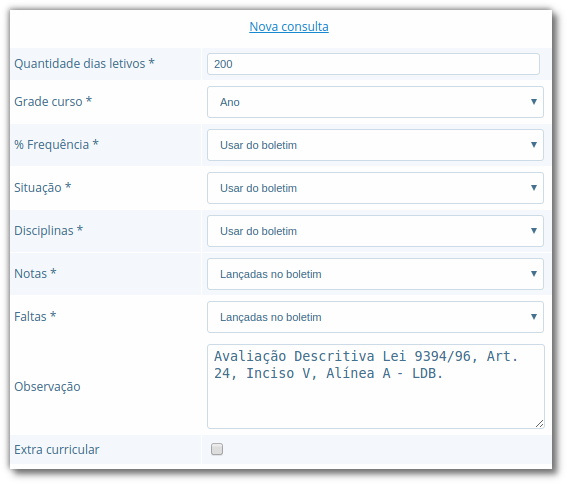

Depois de efetuar a parametrização descrita anteriormente, basta selecionar os registros na listagem, ou clicar na opção **Selecionar todos**, e pressionar o botão **Processar** para iniciar o processamento dos históricos.

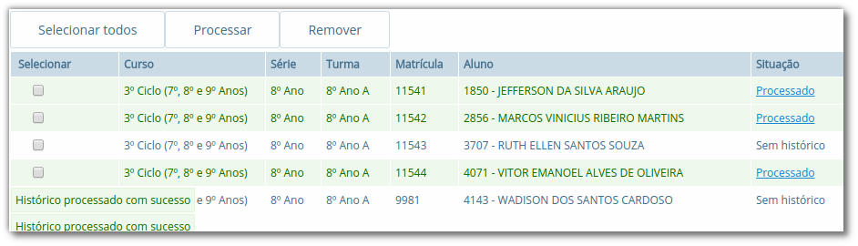

Durante o processamento, o sistema mostra mensagens ao usuário em um console no canto inferior esquerdo da página, úteis para o usuário poder acompanhar o que está acontecendo naquele exato momento. Ao término do processamento o sistema atualizará a coluna **Situação** para cada aluno da listagem.

Caso após o término alguma informação não tenha sido gerada conforme o esperado, basta fazer as modificações nos parâmetros e reprocessar o histórico novamente, pois o sistema tratará de atualizar todos os dados.

> **Nota:** Quando o processo terminar, é possível acessar diretamente o histórico de um aluno, pois ao mudar a **Situação** de **Sem histórico** para **Processado** o sistema torna a palavra na listagem um link que leva diretamente ao cadastro de histórico escolar do aluno em questão.

## Histórico escola avulso

O Histórico Escolar Avulso consiste na inserção de históricos escolares de forma manual, aluno por aluno, sem utilizar as informações lançadas para o aluno no ano letivo. Pode ser utilizado para criar históricos de alunos que vieram de outras instituições ou de alunos que nunca tiveram seus registros informatizados.

A opção está localizada no cadastro do aluno, em que por meio do botão **Atualizar histórico** pode ser visualizada a lista de todos os históricos escolares do aluno. Nesta listagem, o usuário tem a opção criar um histórico ou acessar um histórico na lista e visualizar suas informações.

> **Localização:** Módulo Escola > Cadastros > Alunos > Selecionar Aluno > Selecionar *Atualizar histórico*

Na Figura 60 é apresentada a tabela de inserção das disciplinas do histórico escolar.

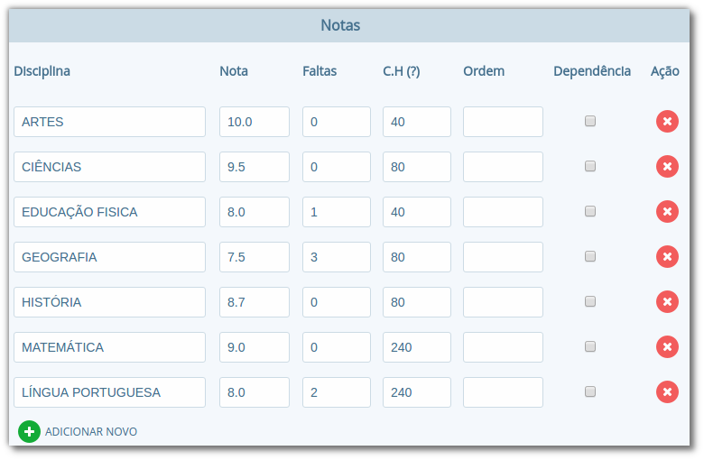

> **Nota:** ao cadastrar um histórico escolar o usuário deverá observar que caso a opção **Faltas globalizadas** seja marcada, um novo campo será exibido para a inserção do número total de faltas, dispensando a inserção das faltas por disciplina na tabela conforme demonstrado.

## Cópia de histórico escolar

O processamento de cópias de históricos, como seu nome já diz, serve para copiar um histórico desejado de um aluno, para que seja repetido em um próximo ano ou em um curso, facilitando o usuário ao cadastrar as notas dos alunos. Com essa funcionalidade, o Diretor(a) ou Secretário(a), não precisará registrar um histórico manualmente, mas sim fazer uma cópia e alterar somente os dados necessários.

No cadastro do aluno, na listagem de **Matrículas**, você deverá selecionar o botão **Atualizar histórico**. Na nova página aberta, acesse o histórico desejado e ao final desta listagem selecione o botão **Copiar histórico**. Em seguida, a cópia do histórico escolhido será mostrada e você poderá editar as informações desejadas, como uma nota, uma disciplina, o ano escolar, entre outras especificações. Para concluir selecione o botão **Salvar**.