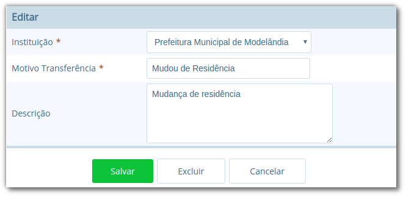
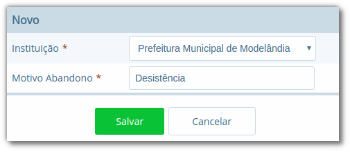
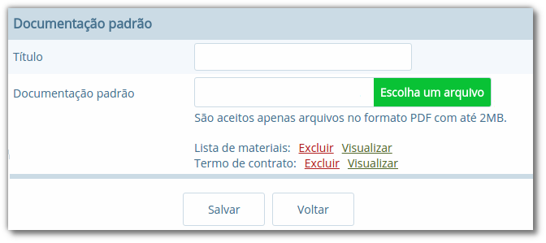
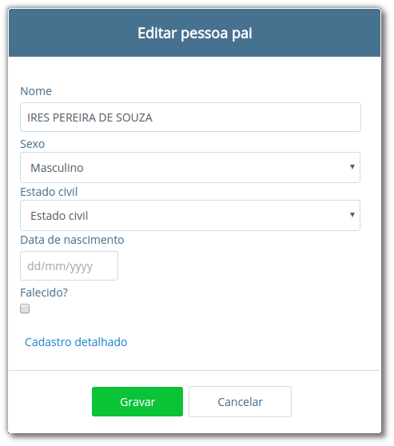
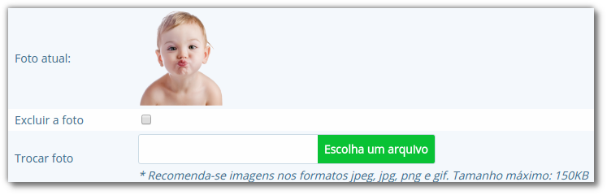
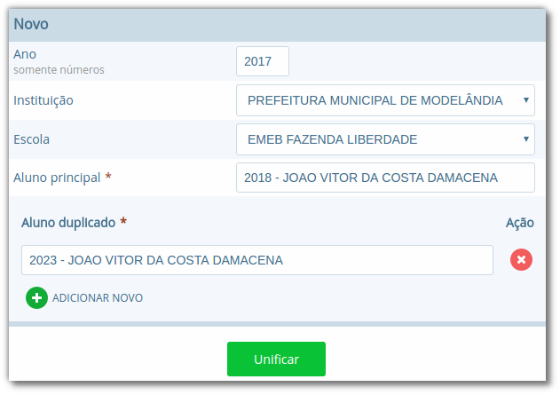
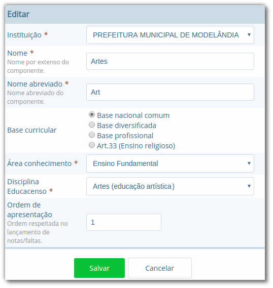
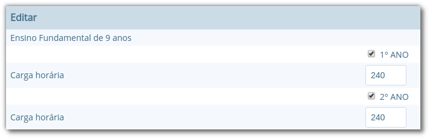
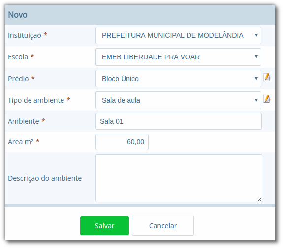
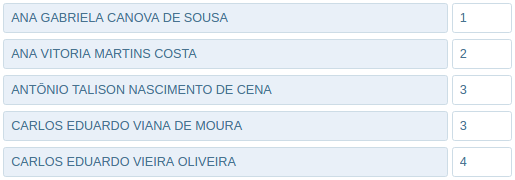

Seção para aprensetar todos os cadastros do módulo *Escola*, como o cadastro de cursos e séries, e dos próprios alunos, sendo o principal cadastro do sistema.

## Tipos de Ocorrências disciplinares, Transferências e Abandono

No cadastro de **Tipos de ocorrências disciplinares**, você poderá cadastrar os tipos de ocorrências disciplinares que podem ser informadas para os alunos. Exemplos: *Desrespeito aos professores*, *Advertência*, *etc*.

> **Localização:** Módulo Escola > Cadastros > Tipos > Matrículas > Tipos de ocorrências disciplinares

Neste cadastro, é possível informar o número máximo de ocorrências, o que significa que quando algum aluno atingir o máximo de ocorrências poderá ser emitido algum aviso aos responsáveis pelo aluno.

No cadastro de **Tipos de transferências** você poderá cadastrar os tipos de transferências que serão usadas posteriormente ao realizar a transferência de um aluno. Exemplos de tipos de transferências: *Mudança de endereço*, *Troca de turma*, *etc*.

> **Localização:** Módulo Escola > Cadastros > Tipos > Matrículas > Tipos de transferência

E por fim, o cadastro de **Tipos de abandono** você poderá cadastrar os tipos de abandono que também serão utilizados posteriormente ao registrar o abandono do aluno. Exemplos de tipo de abandono: *Desistência*, *Falecimento*, *etc*.

> **Localização:** Módulo Escola > Cadastros > Tipos > Matrículas > Tipos de abandono

## Instituição

Neste cadastro você poderá cadastrar as instituições responsáveis pelas escolas da rede de ensino, além de inserir parâmetros e dados específicos da mesma, tanto para controle de datas quanto de funcionalidades.

> **Localização:** Módulo Escola > Cadastros > Instituição

No cadastro de instituições ainda é possível definir uma série de documentações padrões, que permitirão ao município inserir documentos próprios e que não são contemplados pelos relatórios/documentos que o sistema dispõe. Para acessar a funcionalidade, basta selecionar uma instituição na listagem e clicar no botão **Documentação padrão**.

Na nova tela, você deverá definir um título para o respectivo documento e anexá-lo por meio do botão **Escolha um arquivo**, por fim, o sistema irá carregar o documento e apresentá-lo abaixo com as opções de exclusão e visualização, conforme exemplo da Figura 18.

Para que o usuário possa emitir estes documentos, basta ele acessar o módulo **Escola em Documentos > Documentação padrão**.

> **Dica:** É importante anexar arquivos que apresentem uma boa qualidade. Lembrando que serão aceitos somente arquivos no formato **pdf** com até **2MB** quanto ao tamanho.

## Cursos

Neste cadastro você poderá cadastrar os cursos oferecidos pela instituição de ensino. Entretanto, antes de iniciar o cadastramento dos cursos, é importante cadastrar os **Tipo de regime**, **de nível de ensino**, **do próprio ensino** e as **habilitações** (módulo Escola > Cadastros > Tipos > Cursos), sendo que estas informações são preenchidas ao cadastrar um curso.

> **Localização:** Módulo Escola > Cadastros > Cursos

As principais opções do cadastro de cursos são detalhadas a seguir:

Opção | Como funciona?
---|---
Quantidade Etapas | Esta informação define a quantidade de anos escolares do curso. No exemplo da Figura 19 é um curso de Educação Infantil.
Hora/Falta | Nesta opção deve ser informado um valor decimal equivalente a 01 (uma) hora falta. Ex: se as aulas são de 50 minutos, neste campo deverá ser informado o valor 0,83.
Carga Horária | Nesta opção deve ser informada a quantidade de horas total do curso para todas as etapas informadas.
Padrão Ano Escolar | Caso esta opção seja marcada, a quantidade de módulos de uma etapa (série ou ano) do curso será definida pelo ano letivo da escola, caso contrário, os módulos terão de ser informados individualmente por turma. O primeiro caso é o mais comum.

## Escolas

Neste cadastro você poderá cadastrar todas as escolas da rede municipal de ensino. Entretanto, antes de iniciar o cadastramento das escolas, é importante cadastrar o **Tipo de localização** e o **Tipo de rede de ensino** (módulo Escola > Cadastros > Tipos > Escolas), sendo que estas informações são preenchidas ao cadastrar uma escola.

> **Localização:** Módulo Escola > Cadastros > Escolas

As principais opções e/ou componentes do cadastro de escolas são detalhadas a seguir:

Componente | Descrição | Como funciona?
---|---|---
 | Iniciar ano letivo | Ao pressionar este botão, o ano letivo da escola será iniciado.
 | Editar ano letivo | Ao pressionar este botão, será aberto outro cadastro para serem informados os módulos do ano letivo. (Veja mais detalhes no Capítulo VII).
 | Finalizar ano letivo | Ao pressionar este botão, o ano letivo da escola será finalizado. Deve-se notar que é permitido finalizar um ano letivo desde que não exista mais nenhuma matrícula em andamento no ano.
 | Reabrir ano letivo | Ao pressionar este botão, o ano letivo já encerrado será reaberto, possibilitando editar e criar novos dados no mesmo.
--- Ano Finalizado --- | Ano Finalizado | Esta informação é exibida após ter sido pressionar o botão **Finalizar Ano Letivo**.

Quando um ano letivo é iniciado, o sistema realiza uma cópia das turmas que foram cadastradas para o ano letivo que será iniciado. Sendo assim, as turmas serão duplicadas no cadastro de turmas, sendo necessário renomear as turmas que farão parte do novo ano letivo.

## Alunos

Neste cadastro você poderá cadastrar novos alunos, controlar seus dados, responsáveis, deficiências, benefícios e outras informações.

> **Localização:** Módulo Escola > Cadastros > Alunos

Ao selecionar a opção <u>Cadastrar Pessoa</u> ou <u>Editar pessoa</u>, se estiver editando um aluno, uma janela de cadastro rápido será aberta, como mostra a Figura 22. Você deverá preencher os *Dados Básicos* e os *Dados do endereço*  do aluno.

Caso não consiga localizar os dados de endereço na busca (lupa ou digitando diretamente o CEP), você poderá cadastrar um novo endereço usando as opções disponíveis para isto, como mostra a Figura 22.

Após ter alterado ou informado os dados para um novo aluno, pressione o botão **Gravar** e será exibida novamente uma tela similar a apresentada na Figura 21.

O mesmo processo realizado para o aluno poderá ser realizado para o Pai e Mãe do aluno, entretanto, diferentemente do cadastro/edição do nome do aluno, a janela exibirá menos informações. Caso desejar informar mais detalhes, selecione a opção <u>Cadastro detalhado</u>, como mostra a Figura 23.

Quando a opção de cadastro detalhado for selecionada, uma outra página de cadastro com informações mais detalhadas ira abrir em uma nova aba ou janela do navegador. Ao preencher as informações desejadas e pressionar o botão **Gravar** a aba ou janela será automaticamente fechada e retornará para a tela de cadastro do aluno, com as informações atualizadas.

Além destas informações básicas apresentadas acima, podemos cadastrar outras informações no cadastro de alunos, conforme demonstrado a seguir:

Aba | Como funciona?
---|---
Dados pessoais | Nesta aba serão cadastradas todas as informações pessoais do aluno, como pais, responsáveis, data de nascimento, dentre outros campos.
Ficha médica | Nesta aba serão cadastradas todas as informações referentes a ficha médica do aluno, como peso, altura, se já teve algum tipo de doença, dentre outros campos.
Moradia | Nesta aba serão cadastradas todas as informações referentes a moradia do aluno, principalmente o tipo de situação do mesmo.
Recurso prova INEP | Nesta aba serão cadastradas todas as informações referentes ao recursos da prova INEP para coleta de dados no período do Censo escolar.
Projetos | Nesta aba serão cadastradas as informações referentes aos projetos que o aluno participa, principalmente as datas de início e término do mesmo.
Uniforme escolar | Nesta aba serão cadastradas todas as informações referentes ao uniforme escolar do aluno, como por exemplo o tamanho das peças.

> **Nota:** As abas de *Ficha Médica*, *Moradia*, *Recursos prova INEP*, *Projetos* e *Uniforme escolar* no cadastro de alunos, não são obrigatórias, servem somente para complemento e detalhamento do cadastro do mesmo. A <u>obrigatoriedade</u> aplica-se somente aos *Dados Pessoais* do aluno.

O sistema também traz a inovação de gravar fotos no cadastro dos alunos, que poderão ser visualizadas tanto nos cadastros quanto em relatórios. O procedimento de inserção da imagem pode ser efetuado tanto no cadastro da *Pessoa Física* quanto em *Alunos*.

Para cadastrar uma foto, use a opção **Escolha um arquivo**, selecione o arquivo de foto desejado e confirme. Após gravar, o resultado será similar ao apresentado na Figura 24, tanto em modo cadastro em Pessoa Física quanto na exibição/edição no cadastro de alunos.

> **Nota:** Recomenda-se o uso de imagens nos formatos **jpg**, **jpeg**, **png** e **gif**, com tamanho máximo de **150KB**, garantindo assim qualidade de imagem e alta performance no upload e exibição da foto.

> **Dica:** Com a funcionalidade de fotos e a utilização de uma webcam, é possível coletar fotos para todos os alunos da escola e assim ter um cadastro ainda mais completo na rede de ensino.

### Unificação de alunos

Embora o sistema possua diversas verificação para evitar a duplicidade de dados, como o CPF e código INEP do aluno, em alguns casos pode ocorrer em que os campos utilizados para verificação não foram informados, ou preenchidos de forma incorreta, e portanto, ao não efetuar a busca do aluno antes da criação, acaba por resultar em um cadastro duplicado.

Entretanto, para que o usuário possua autonomia de corrigir estes dados, sem ter que excluir os alunos duplicados e reinserir as informações no aluno correto, existe a funcionalidade de **Unificação de alunos**, conforme Figura 25.

> **Localização:** Módulo Escola > Ferramentas > Unificações > Unificação de alunos

Na tela de unificação, o usuário deverá preencher o campo **Aluno principal** com o aluno que será mantido no sistema, pesquisando por nome ou código, e na tabela **Aluno duplicado**, inserir todos os demais cadastros do respectivo aluno, para unificação dos dados. Ao clicar no botão **Salvar**, todas as matrículas e históricos dos cadastros duplicados serão migradas para o aluno definido como principal, excluindo os demais registros.

## Componentes curriculares

Neste cadastro você poderá cadastrar as disciplinas que poderão ser lecionadas na rede de ensino. Antes de iniciar o cadastramento dos componentes curriculares, é importante cadastrar as **Áreas de conhecimento** e os **Tipos de dispensa de disciplina**, sendo que os cadastros das áreas de conhecimento serão informados ao cadastrar as disciplinas e os tipos de dispensa na matrícula do aluno. O processo de matrícula de alunos será visto nos próximos capítulos.

> **Localização:** Módulo Escola > Cadastros > Componentes curriculares

O cadastro de **Tipos de dispensa** permite cadastrar motivos pelos quais determinados alunos podem ser dispensados de uma disciplina. No cadastro, basta informar uma descrição e no processo de matrícula, que será explicado em breve, poderá ser utilizada a opção **Dispensa de componentes curriculares** para dispensar um aluno, por um destes motivos pré-cadastrados, de uma determinada disciplina.

> **Localização:** Módulo Escola > Cadastros > Tipos > Componentes curriculares > Tipos de dispensa

## Séries e configuração dos Anos Escolares

No cadastro **Séries** você poderá cadastrar todas as séries – ou anos escolares – de cada curso da instituição. As séries/anos específicas das escolas serão vistas em seguida, no cadastro **Séries da escola**.

> **Localização:** Módulo Escola > Cadastros > Séries

![Formulário para edição de ano escolar no cadastro de séries, com os campos "Instituição", "Curso", "Série", "Etapa Curso", "Regra de avaliação", "Regra de avaliação diferenciada", "Concluente", "Carga Horária", "Dias letivos", "Idade padrão", "Faixa etária" e "Observação histórico", opções "Exibir alerta ao tentar matricular alunos fora da faixa etária da série/ano", "Bloquear matrículas de alunos fora da faixa etária da série/ano" e "Exigir INEP para a matrícula", botões "Salvar", "Excluir" e "Cancelar"](../img/user-docs/user-figura-27-editando-ano-escolar-cadastro-series.png)

As principais opções do cadastro de séries/anos são detalhadas a seguir:

Opção | Como funciona?
---|---
Etapa curso | Nesta opção deve ser informada a etapa do curso correspondente a série/ano que se está cadastrando.
Regra avaliação | Nesta opção deve ser informada a regra de avaliação que será utilizada para esta série/ano. O assunto regras de avaliação será visto nos próximos capítulos.
Regra de avaliação diferenciada | Esta informação será preenchida somente quando o parâmetro '*Utilizar regra de avaliação diferenciada*' estiver marcado no cadastro das escolas, e neste caso irá utilizar uma regra diferente da geral.
Carga horária | Nesta opção deve ser informada a carga horária total da série/ano, informação que posteriormente é utilizada para verificar a frequência do aluno.

Depois de cadastradas as séries/anos padrões do curso, deverão ser configurados os anos escolares, procedimento o qual definirá para quais séries/anos escolares determinada disciplina estará disponível.

Ao acessar uma disciplina da listagem, exibirá um botão chamado **Configurar anos escolares**, e ao pressioná-lo, será aberto o modo de edição conforme ilustrado na Figura 28.

No cadastro de **Séries da escola** você poderá cadastrar todas as séries de uma escola, a qual herda as informações do cadastro de séries/anos padrões da instituição, mas podendo também definir configurações específicas da escola.

> **Localização:** Módulo Escola > Cadastros > Séries da escola

As principais opções encontradas no cadastro de Séries da escola estão detalhadas a seguir:

Opção | Como funciona?
---|---
Nome | Nesta opção serão listadas todas as disciplinas padrão para a série/ano da instituição, sendo que é possível definir quais estarão disponíveis para a série/ano da escola.
Carga horária | Nesta opção poderá ser informada uma carga horária para a escola diferente do padrão da série/ano da instituição.
Usa padrão do componente | Esta opção sempre estará marcada, e informa ao sistema que a série/ano da escola utiliza a carga horária padrão da instituição. Caso algum valor tenha sido informado no campo Carga horária, esta opção deve ser desmarcada.
Bloquear enturmação após atingir limite de vagas | Ao marcar esta opção, quando atingir o limite de vagas que é definido na turma, não será mais possível fazer enturmações.
Bloquear cadastro de novas turmas antes de atingir limite de vagas (no mesmo turno) | Ao marcar esta opção, não será possível cadastrar novas turmas até que o limite de vagas da turma for atingido. Neste caso, em uma turma matutina que suporta 25 alunos, não será possível criar outra turma matutina até que as 25 vagas estejam preenchidas.

## Infraestrutura
No cadastro **Infraestrutura** você poderá cadastrar todas as informações referentes aos prédios, blocos, tipos de cômodos e os cômodos propriamente dito, de todas as escolas da rede de ensino.

> **Localização:** Módulo Escola > Cadastros > Infraestrutura

Em **Cadastros > Tipos > Infraestrutura** é possível ainda cadastrar os prédios, funções dos ambientes do prédio e os próprios ambientes. Estes cadastros são detalhados a seguir:

Submenu | Como funciona?
---|---
Prédios | Neste cadastro, você pode informar os dados cadastrais e de localização dos edifícios e/ou instalações de cada escola.
Tipo de ambiente | Neste cadastro, você poderá definir as funções dos ambiente dos prédios; Ex. Sala de aula, Sala de reuniões, Laboratório de Informática, etc.
Ambiente | O campo ambiente é informado no próprio cadastro de Infraestrutura, e nele você poderá cadastrar os ambientes propriamente ditos, informando as descrições dos mesmos, assim como localização e área ocupada no prédio. Um exemplo pode ser visto na Figura 29, como 'Sala 01'.

## Turmas

Neste cadastro você poderá informar os dados das turmas do ano letivo corrente, qual sua localização na escola, professor regente, capacidade de alunos e também os horários das aulas, caso estes sejam diferentes dos períodos da série/ano.

> **Localização:** Módulo Escola > Cadastros > Turmas

As principais opções do cadastro de **Turmas** são encontradas na aba Dados gerais, e serão detalhadas a seguir:

Opção | Como funciona?
---|---
Sala | Nesta opção poderá ser informada a sala onde a turma funcionará. Esta sala deve ter sido cadastrada previamente no cadastro de Infraestrutura.
Tipo de Turma | O Tipo de turma é um cadastro localizado em Cadastros > Tipos > Turma, e serve para criar um identificador ou classificação para uma turma. Ex: Normal, Aceleração, etc.
Máximo de Alunos | Define a quantidade de alunos que a turma pode comportar. No ato das enturmações, processo que será visto mais adiante, o sistema emite um aviso caso este limite tenha sido atingido.
Ativo | Define se a turma está ativa ou inativa. Caso esta opção seja desmarcada, não será possível enturmar alunos nessa turma.
Multi-Seriada | Caso esta opção seja marcada, uma nova opção será exibida, solicitando ao usuário informar quais são as outras séries que farão parte desta turma.
Horários de início e fim | Nesta opção são informados os horários de início e de fim das aulas. Deve-se preencher os campos de acordo com o turno que a turma pertence.
Turno | Nesta opção deve ser informado o turno correspondente a turma em questão. Esta informação é necessária para a correta emissão dos relatórios. As opções são: Matutino, Vespertino, Noturno e Integral.
Modelo de relatório boletim | Nesta opção é definido o modelo de boletim que será emitido para a turma em questão. Ao criar uma turma, este campo deverá ser preenchido, sendo assim, caso não tenha conhecimento do tipo de boletim que deverá ser selecionado, entre em contato com o nosso suporte.
Ano | Nesta opção é definido o ano em que a turma selecionada será utilizada.

> **Dica:** A aba de **Dados adicionais** contém campos específicos que são colhidos na fase inicial do Educacenso/INEP, portanto, mesmo não se tratando de campos obrigatórios é importante atualizá-los para que facilite no momento da coleta de dados do Censo.

Na visualização da turma existem dois processos para trabalhar com a ordenação dos alunos nas listas de presenças, sendo os botões **Reclassificar alunos alfabeticamente** e **Editar sequência de alunos na turma**.

Na opção de **Reclassificação**, quando selecionada, o sistema realizará a reordenação dos alunos no diário e nos relatórios que são controlados por ordem de chegada após a data base inserida no cadastro da instituição, alterando para que estes sejam listados novamente de forma alfabética desconsiderando a data base para ordenação.

Já a opção de **Editar a sequência dos alunos**, quando selecionada, o usuário será redirecionado a uma listagem com o nome de todos os alunos, sendo possível inserir a ordem de cada um de forma manual, como apresenta a imagem abaixo:

> **Nota:** Sempre que uma turma for descontinuada, opte por não excluir a mesma. O campo **Ativo**, quando desmarcado, deve resolver a situação. Após desmarcar o campo **Ativo** na turma desejada, a mesma não será mais listada nas opções de enturmação, nem mesmo nos relatórios.