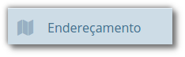
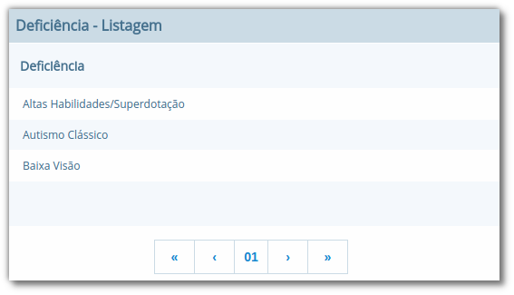
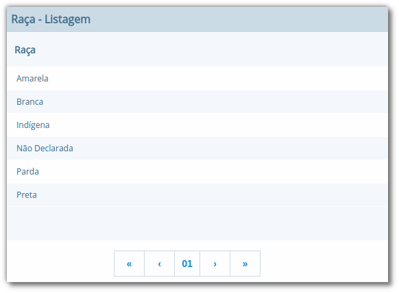

Apresentação dos módulos de endereçamento e pessoas físicas e jurídicas, além dos tipos deficiência, cor ou raça e religião.

## Módulo Endereçamento

No módulo **Endereçamento** devem ser inseridas as informações dos *bairros*, *logradouros* e *CEPs* da instituição para que possam ser utilizados no cadastro de pessoas, alunos, escolas e outros. Para acessar o mesmo, basta clicar em **Endereçamento** apresentado na barra de módulos do sistema.

## Módulo Pessoas

No módulo você pode inserir as informações das *pessoas físicas e jurídicas* que serão trabalhadas dentro do sistema. Estas pessoas incluem escolas, professores, pais, alunos dentro outros, que depois de registrados no sistema, passa a fazer parte de um cadastro único.

Além do cadastramento das pessoas físicas e jurídicas, ainda é possível no módulo Pessoas, registrar os tipos de deficiência e tipos de cor ou raça, informações importantes na fase de coleta de dados do Censo escolar.

### Tipos de deficiência e cor ou raça

No cadastro de **Tipos de deficiência** você poderá cadastrar as deficiências que posteriormente podem ser informadas para alunos e professores. Exemplos de deficiências: *Física*, *Visual*, *Auditiva*, *etc*.

Os tipos de deficiências são pré-cadastrados com base nos tipos definidos nacionalmente pelo Censo Escolar, conforme disponibilizado em tabela.

> **Localização:** Módulo Pessoas > Cadastros > Tipos > Tipos de deficiência

O cadastro de **Tipos de cor ou raça**, também apresentado no módulo **Pessoas**, é responsável pelo cadastramento dos tipos de cor ou raça que serão utilizados no sistema, e assim como em **Tipos de deficiências**, é relacionado com os tipos nacionais identificados pelo **Censo escolar**.

> **Localização:** Módulo Pessoas > Cadastros > Tipos > Tipos de cor ou raça

> **Importante:** Os cadastros de **Tipos de deficiência** e **Tipos de cor ou raça**, são informações importantes para o **Censo escolar**, portanto, é necessário manter os mesmos atualizados, com o vínculo correto, para que todos os alunos e docentes do sistema apresentem a informação correta durante a coleta.

