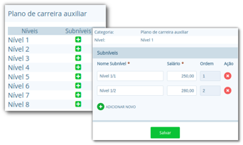
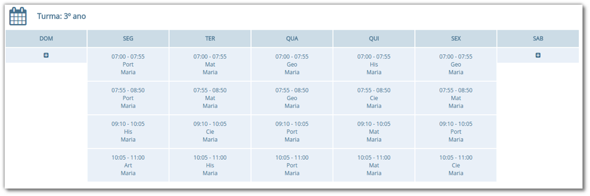

Nesta seção apresentaremos os processos para a gestão de servidores no sistema. Um servidor no i-Educar terá seu registro para uso interno dos gestores, para fins cadastrais de controle de alocação de horas, avaliação de desempenho, quadro de horários, entre outros, ou para uso externo no caso de usuários da secretaria da escola. Para que o servidor tenha acesso ao sistema, deverá ser criado um usuário no módulo Configurações, que possibilitará o acesso ao sistema para consultas ou inserção de informações. Os tópicos a seguir fornecerão os detalhes sobre estes processos.

## Servidores

Neste cadastro o usuário registrará todos os funcionários da rede municipal, sejam eles servidores que utilizarão o próprio i-Educar ou o Diário online; ou apenas servidores que serão gerenciados internamente pelo município.

> **Localização:** Módulo Servidores > Cadastros > Servidores

Neste cadastro, é necessário o servidor ter sido previamente cadastrado em Pessoa física, sendo o único vínculo obrigatório do mesmo, e caso o servidor tenha acesso ao i-Educar, como os usuários da secretaria da unidade escolar, então será feito um cadastro em **Configurações > Permissões > Usuários**.

> **Nota:** É importante lembrar que somente o cadastro **Pessoa física** é obrigatório para o cadastro de um servidor. Sendo assim deve-se  vincular em usuários somente se acessar o sistema, como no caso de membros da secretaria.

O cadastro de **Servidores** é o cadastro centralizador da gestão dos servidores no sistema. É neste cadastro que serão controladas a carga horária de cada servidor, avaliações de desempenho, faltas e atrasos, e outras informações pertinentes.

Ao cadastrar um novo servidor o sistema solicitará algumas informações, como as funções do mesmo. Nesta situação caso a função seja de professor(a), será necessário informar também quais Componentes Curriculares (disciplinas) e Cursos o servidor poderá lecionar, por meio das lupas no quadro Funções Servidor, como pode ser visto na Figura 34. A opção carga horária também é obrigatória, pois este valor é controlado no momento da alocação dos servidores nas turmas do ano letivo.

Além dos campos da aba Dados gerais, na aba Dados adicionais será possível inserir as informações de cursos superiores ou licenciaturas, assim como outras formações do servidor, sendo que estes dados são exigidos anualmente pelo Educacenso/INEP.

Ao editar as informações de um servidor que já tenha sido alocado para trabalhar em alguma escola, o sistema demonstrará qual a carga horária utilizada e em qual período e escola consta esta alocação, conforme demonstrado na Figura 35.

Quando o cadastro de um servidor é aberto para edição, é exibida uma série de opções de gerenciamento, as quais são detalhadas a seguir:

Opção | Como funciona ?
--|--
Avaliação de Desempenho | Nesta opção o usuário o gestor de educação poderá registrar informações descritivas que possibilitam organizar a avaliação de cada servidor. O cadastro funciona como uma espécie de livro de registros para cada servidor.
Faltas/Atrasos | Nesta opção poderão ser registradas informações em relação às faltas e atrasos dos servidores, com detalhes como data, horários, se justificas ou não, dentre outros.
Alocar Servidor | Nesta opção o usuário poderá efetuar a alocação do servidor para o turno de uma determinada escola. Ao abrir esta opção, poderão ser visualizadas a carga horária total, o saldo disponível em horas e os períodos e carga horária que já estão alocados e em qual escola estão alocados.
Alterar Nível | Nesta opção o usuário poderá alterar o nível da Categoria de Níveis do servidor, como por exemplo, no caso de progressões nas tabelas.
Substituir Horário Servidor | Nesta opção o usuário poderá selecionar outro servidor que substituirá todos ou apenas alguns horários de aula do servidor atual.
Afastar Servidor | Nesta opção, o usuário poderá executar o afastamento do servidor, por algum motivo específico como licença prêmio, auxílio-maternidade, entre outros, selecionando neste momento cada servidor que irá substituí-lo em cada horário que está sob sua responsabilidade.
Vincular professor a turma | Nesta opção, o usuário poderá vincular o docente nas suas respectivas turmas com finalidade de realizar a migração dessas informações, as quais são exigidas anualmente pelo Educacenso/INEP, ou utilização das mesmas no Diário online do professor.

## Funções e Categorias ou níveis

No cadastro de **Funções** o usuário poderá cadastrar as funções dos profissionais gerenciados no sistema, tais como professores, diretores, secretários, entre outros.

> **Localização:** Módulo Servidores > Cadastros > Tipos > Funções

Estas funções serão utilizadas no momento do cadastro de um servidor, o qual será visto a seguir. No cadastro de **Categoria ou níveis** o usuário poderá inserir informações em relação às tabelas de progressão dos servidores, níveis, subníveis e faixas salariais, oriundas do plano de carreira ou estatuto do servidor.

> **Localização:** Módulo Servidores > Cadastros > Tipos > Categoria ou níveis

## Escolaridade e Motivos de afastamento

No cadastro de **Escolaridade** o usuário poderá cadastrar os níveis de escolaridade que serão utilizadas posteriormente no cadastro dos servidores. Exemplos: *Nível Superior Completo, Pós-Graduação, etc*.

> **Localização:** Módulo Servidores > Cadastros > Tipos > Escolaridade

No cadastro de **Motivos de afastamento** o usuário poderá cadastrar os motivos pelos quais servidores são afastados de suas funções. Exemplos: *Licença Prêmio, Auxílio-maternidade, etc*.

> **Localização:** Módulo Servidores > Cadastros > Tipos > Motivos de afastamento

Para executar os afastamentos de servidores no sistema existe uma função específica na página de cadastro de cada servidor, onde será obrigatório informar o motivo de afastamento, informado previamente neste cadastro.

## Quadro de horários

No cadastro de **Quadro de horários** é possível efetuar a gestão dos dias da semana, horários, disciplinas e professores para cada turma.

Com estas informações, o controle de carga horária dos servidores é mais eficiente, pois a alocação dos mesmos no quadro de horários é relacionada ao seu número de horas disponível na semana em toda a rede de ensino municipal.

> **Localização:** Módulo Servidores > Cadastros > Quadro de horários

Ao acessar o cadastro, o usuário pode buscar por um quadro de horário existente ou criar um novo. Caso a opção selecionada seja para criar um novo, será aberto um calendário similar ao da Figura 37, porém sem os horários. Ao clicar em um dos dias da semana, será aberta uma nova janela, onde deverão ser informados o Componente curricular (disciplina), horário inicial e final e professor(a) de cada horário de aula. Este procedimento deve ser feito para todos os horários de cada dia da semana.
